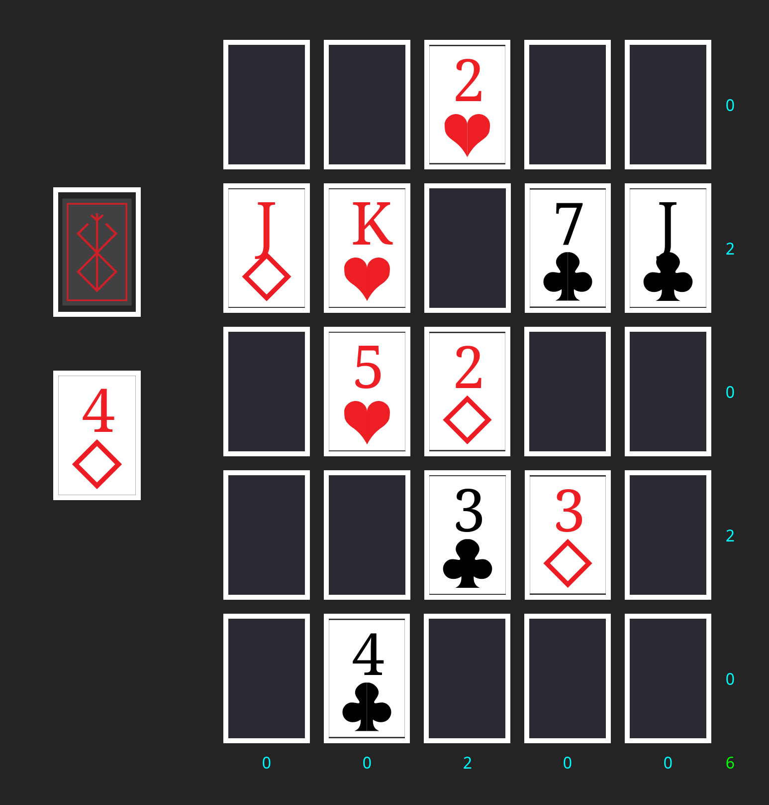
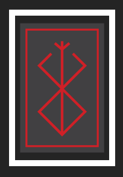
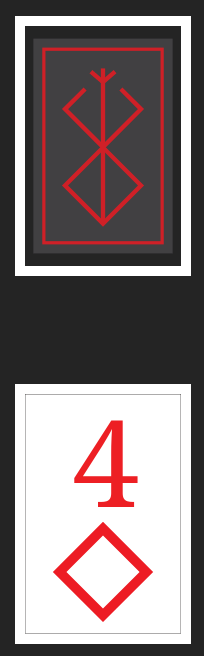
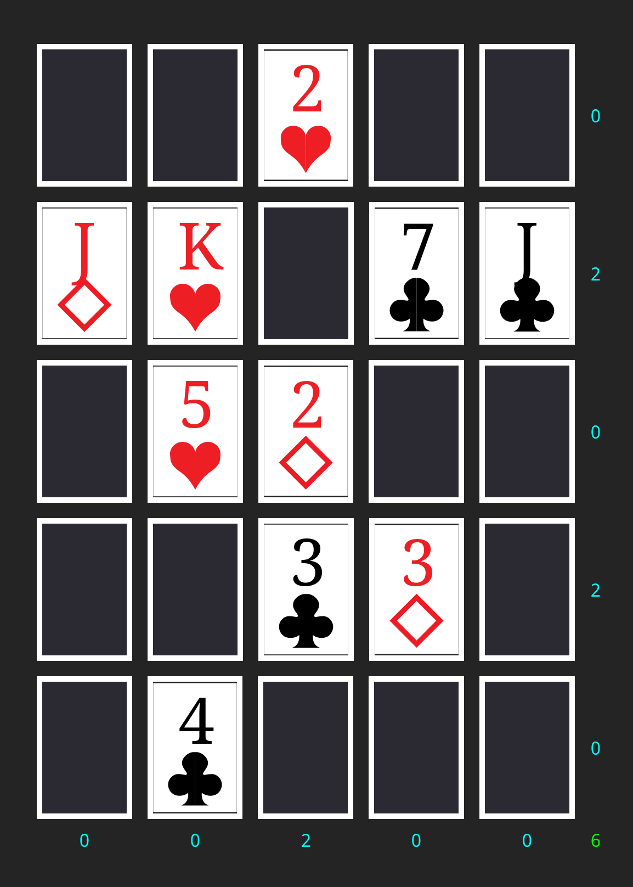
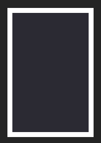
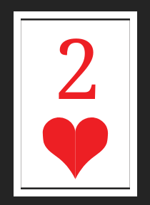

# About
Web app using Svelte that allows the user to play the card game Poker Squares!

## Rules
* Basic rules on [`Wikipedia`](https://en.wikipedia.org/wiki/Poker_squares)
* More detail on [`Solitaire City`](http://www.solitairecity.com/Poker_Squares.shtml)

## Preview

## Game Pieces
Deck:  

Deck (top) with Active card (bottom):  

Grid:  

Empty Grid Spot:  

Occupied Grid Spot:  

## How to Play
The game will generate a full 52 card deck and then shuffle and slice the deck down to the 25 that are used in Poker Squares.
Then the user will click on the deck to deal a card, which is placed in the active card slot.
At this point, the user can click on any available space in the grid to play their card.
Scoring will be automatically performed by the game.
Refresh the page to start over with a new deck.
